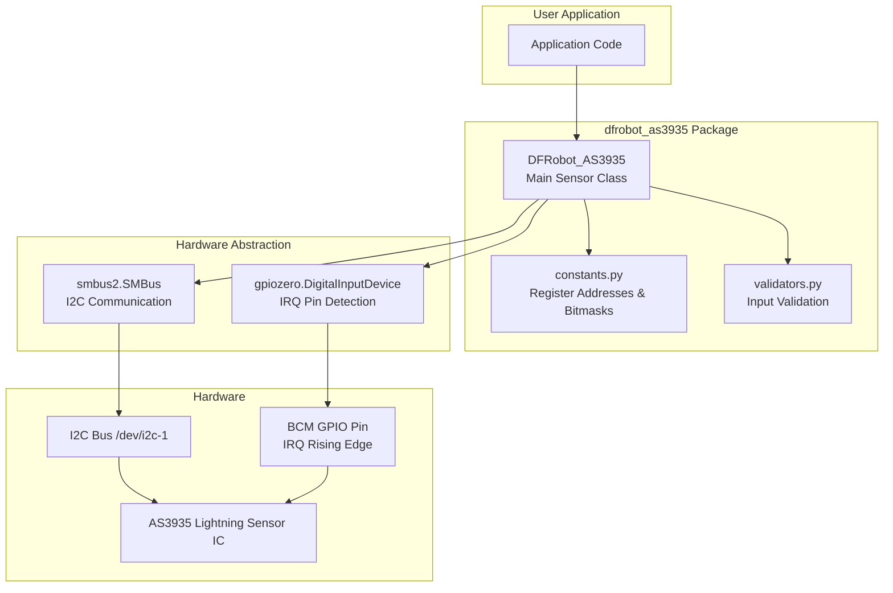
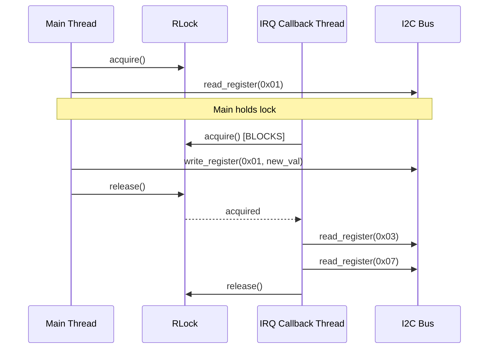
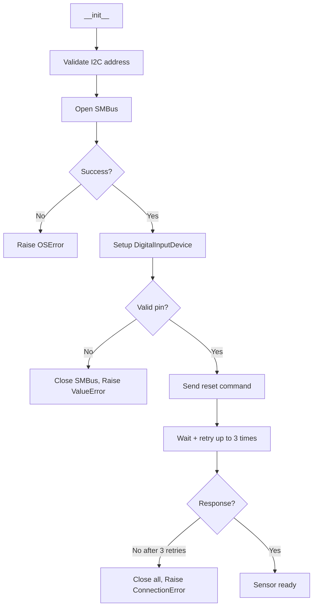

# Design Document: AS3935 Library Modernization

## Overview

This design describes the modernization of the DFRobot AS3935 Lightning Sensor Python library to run on Raspberry Pi Zero 2W with Python 3.11+ and Raspberry Pi OS Bookworm. The modernized library replaces deprecated dependencies (`smbus` → `smbus2`, `RPi.GPIO` → `gpiozero`), introduces a proper pip-installable package structure, adds type safety and input validation, fixes hardware protocol bugs per the AS3935 datasheet, and establishes a testable codebase with mocked I2C communication.

The library communicates with the AS3935 IC over I2C to configure the sensor and read lightning event data. Interrupt detection on the IRQ pin notifies the application of lightning strikes, disturbers, or noise events.

### Key Design Decisions

1. **smbus2 as I2C backend** — Pure Python, drop-in compatible API, no compiled C extensions needed.
2. **gpiozero for GPIO** — Works on Bookworm (kernel 6.6+) where sysfs GPIO was removed. Uses `DigitalInputDevice` with `when_activated` callback for rising-edge detection.
3. **Context manager pattern** — Ensures deterministic resource cleanup of I2C bus and GPIO pin.
4. **threading.RLock** — Serializes all I2C access to prevent corruption when interrupt callbacks fire concurrently with main-thread operations.
5. **Hypothesis for property-based testing** — Mature Python PBT library with excellent pytest integration and built-in strategies for integers, composite data.

## Architecture



### Package Layout

```
DFRobot_AS3935/
├── pyproject.toml
├── README.md
├── LICENSE
├── src/
│   └── dfrobot_as3935/
│       ├── __init__.py          # Exports DFRobot_AS3935 + all constants
│       ├── sensor.py            # Main DFRobot_AS3935 class
│       ├── constants.py         # Register addresses, bitmasks, config values
│       └── validators.py        # Input validation functions
├── examples/
│   ├── lightning_detection.py   # Interrupt-based lightning detection
│   └── sensor_configuration.py # Configuration demonstration
└── tests/
    ├── conftest.py              # Shared fixtures (mock SMBus, mock GPIO)
    ├── test_sensor.py           # Unit tests for sensor class
    ├── test_validators.py       # Unit tests for validation
    ├── test_constants.py        # Smoke tests for constant definitions
    └── test_properties.py       # Property-based tests (Hypothesis)
```

### Layered Responsibility

| Layer | Responsibility |
|-------|---------------|
| `constants.py` | Named constants for all register addresses, bitmasks, config values, interrupt codes, commands |
| `validators.py` | Pure validation functions that raise `ValueError` on invalid input |
| `sensor.py` | I2C communication, GPIO setup, register read-modify-write, context manager, thread safety |
| `__init__.py` | Public API surface via `__all__` |

## Components and Interfaces

### DFRobot_AS3935 (Main Sensor Class)

```python
class DFRobot_AS3935:
    """AS3935 Lightning Sensor driver for Raspberry Pi.

    Communicates with the AS3935 IC over I2C and detects lightning
    events via GPIO interrupt on the IRQ pin.

    Usage:
        with DFRobot_AS3935(address=0x03, bus=1, irq_pin=4) as sensor:
            sensor.set_indoors()
            sensor.register_interrupt_callback(my_handler)
    """

    def __init__(self, address: int, bus: int = 1, irq_pin: int = 4) -> None: ...
    def __enter__(self) -> "DFRobot_AS3935": ...
    def __exit__(self, exc_type, exc_val, exc_tb) -> bool: ...
    def close(self) -> None: ...

    # Configuration
    def reset(self) -> None: ...
    def power_up(self) -> None: ...
    def power_down(self) -> None: ...
    def set_indoors(self) -> None: ...
    def set_outdoors(self) -> None: ...
    def set_noise_floor_level(self, level: int) -> None: ...
    def get_noise_floor_level(self) -> int: ...
    def set_watchdog_threshold(self, threshold: int) -> None: ...
    def get_watchdog_threshold(self) -> int: ...
    def set_spike_rejection(self, rejection: int) -> None: ...
    def get_spike_rejection(self) -> int: ...
    def set_tuning_caps(self, capacitance: int) -> None: ...
    def set_min_strikes(self, strikes: int) -> None: ...
    def set_lco_fdiv(self, division: int) -> None: ...
    def set_irq_output_source(self, source: int) -> None: ...
    def clear_statistics(self) -> None: ...

    # Disturber control
    def enable_disturber(self) -> None: ...
    def disable_disturber(self) -> None: ...

    # Data reading
    def get_interrupt_source(self) -> int: ...
    def get_lightning_distance_km(self) -> int: ...
    def get_strike_energy_raw(self) -> int: ...
    def get_strike_energy_normalized(self) -> float: ...

    # Interrupt handling
    def register_interrupt_callback(self, callback: Callable[[], None]) -> None: ...

    # Internal (private)
    def _read_register(self, register: int) -> int: ...
    def _write_register(self, register: int, value: int) -> None: ...
    def _read_modify_write(self, register: int, mask: int, value: int) -> None: ...
    def _ensure_open(self) -> None: ...
```

### Constants Module Interface

```python
# Register Addresses
REG_AFE_GAIN       = 0x00   # AFE gain and power-down
REG_THRESHOLD      = 0x01   # Noise floor level and watchdog threshold
REG_LIGHTNING      = 0x02   # Spike rejection, min strikes, clear stats
REG_INT_MASK_ANT   = 0x03   # Interrupt source, mask disturber, LCO fdiv
REG_ENERGY_LSB     = 0x04   # Strike energy LSB
REG_ENERGY_MSB     = 0x05   # Strike energy MSB
REG_ENERGY_MMSB    = 0x06   # Strike energy MMSB (bits 4:0)
REG_DISTANCE       = 0x07   # Distance estimation (bits 5:0)
REG_DISP_TUNE      = 0x08   # Display/tuning: LCO, SRCO, TRCO, cap
REG_PRESET_DEFAULT = 0x3C   # Preset default command register
REG_CALIB_RCO      = 0x3D   # Calibrate RCO command register

# Bitmasks
MASK_PWD           = 0x01   # Power-down bit (reg 0x00, bit 0)
MASK_AFE_GAIN      = 0x3E   # AFE gain bits (reg 0x00, bits 5:1)
MASK_NF_LEV        = 0x70   # Noise floor level (reg 0x01, bits 6:4)
MASK_WDTH          = 0x0F   # Watchdog threshold (reg 0x01, bits 3:0)
MASK_SREJ          = 0x0F   # Spike rejection (reg 0x02, bits 3:0)
MASK_MIN_NUM_LIGH  = 0x30   # Minimum lightning count (reg 0x02, bits 5:4)
MASK_CL_STAT       = 0x40   # Clear statistics bit (reg 0x02, bit 6)
MASK_INT           = 0x0F   # Interrupt source (reg 0x03, bits 3:0)
MASK_MASK_DIST     = 0x20   # Mask disturber (reg 0x03, bit 5)
MASK_LCO_FDIV      = 0xC0   # LCO frequency division (reg 0x03, bits 7:6)
MASK_ENERGY_MMSB   = 0x1F   # Energy MMSB (reg 0x06, bits 4:0)
MASK_DISTANCE      = 0x3F   # Distance (reg 0x07, bits 5:0)
MASK_DISP_LCO      = 0x80   # Display LCO on IRQ (reg 0x08, bit 7)
MASK_DISP_SRCO     = 0x40   # Display SRCO on IRQ (reg 0x08, bit 6)
MASK_DISP_TRCO     = 0x20   # Display TRCO on IRQ (reg 0x08, bit 5)
MASK_DISP_FLAGS    = 0xE0   # All display bits (reg 0x08, bits 7:5)
MASK_TUN_CAP       = 0x0F   # Tuning capacitance (reg 0x08, bits 3:0)

# Configuration Values
AFE_GAIN_INDOOR    = 0x24   # Indoor AFE gain setting
AFE_GAIN_OUTDOOR   = 0x1C   # Outdoor AFE gain setting

# Interrupt Source Codes
INT_LIGHTNING      = 0x08   # Lightning detected
INT_DISTURBER      = 0x04   # Disturber detected
INT_NOISE          = 0x01   # Noise level too high

# Command Bytes
CMD_PRESET_DEFAULT = 0x96   # Written to REG_PRESET_DEFAULT for reset
CMD_CALIB_RCO      = 0x96   # Written to REG_CALIB_RCO for calibration

# Valid parameter sets
VALID_I2C_ADDRESSES    = (0x01, 0x02, 0x03)
VALID_MIN_STRIKES      = (1, 5, 9, 16)
VALID_CAPACITANCE_RANGE = range(0, 121, 8)  # 0, 8, 16, ..., 120
```

### Validators Module Interface

```python
def validate_capacitance(value: int) -> None: ...
def validate_noise_floor_level(value: int) -> None: ...
def validate_watchdog_threshold(value: int) -> None: ...
def validate_spike_rejection(value: int) -> None: ...
def validate_i2c_address(value: int) -> None: ...
def validate_lco_fdiv(value: int) -> None: ...
def validate_min_strikes(value: int) -> None: ...
```

Each validator raises `ValueError` with a message containing the parameter name, provided value, and valid constraint.

## Data Models

### Register Map (AS3935)

| Register | Address | Fields |
|----------|---------|--------|
| AFE_GAIN | 0x00 | PWD (bit 0), AFE_GB (bits 5:1) |
| THRESHOLD | 0x01 | WDTH (bits 3:0), NF_LEV (bits 6:4) |
| LIGHTNING | 0x02 | SREJ (bits 3:0), MIN_NUM_LIGH (bits 5:4), CL_STAT (bit 6) |
| INT_MASK_ANT | 0x03 | INT (bits 3:0), MASK_DIST (bit 5), LCO_FDIV (bits 7:6) |
| S_LIG_L | 0x04 | Energy LSB (bits 7:0) |
| S_LIG_M | 0x05 | Energy MSB (bits 7:0) |
| S_LIG_MM | 0x06 | Energy MMSB (bits 4:0) |
| DISTANCE | 0x07 | Distance (bits 5:0) |
| DISP_TUNE | 0x08 | TUN_CAP (bits 3:0), DISP_TRCO (bit 5), DISP_SRCO (bit 6), DISP_LCO (bit 7) |
| PRESET_DEFAULT | 0x3C | Command register (write 0x96 to reset) |
| CALIB_RCO | 0x3D | Command register (write 0x96 to calibrate) |

### Strike Energy Calculation

The raw 21-bit energy value is assembled from three registers:

```
raw_energy = (REG_ENERGY_MMSB & 0x1F) << 16 | REG_ENERGY_MSB << 8 | REG_ENERGY_LSB
```

- Raw range: 0 to 2,097,151 (2^21 - 1)
- Normalized: `raw_energy / 2_097_151` → float in [0.0, 1.0]

### Clear Statistics Sequence

Per the AS3935 datasheet, the CL_STAT bit must be toggled in a specific 4-write sequence:

```
Write CL_STAT = 0 (low)
Write CL_STAT = 1 (high)
Write CL_STAT = 0 (low)
Write CL_STAT = 1 (high)
```

This differs from the original library which used only 3 writes (high-low-high).

### Thread Safety Model



### Initialization Sequence



## Correctness Properties

*A property is a characteristic or behavior that should hold true across all valid executions of a system — essentially, a formal statement about what the system should do. Properties serve as the bridge between human-readable specifications and machine-verifiable correctness guarantees.*

### Property 1: Register read returns correct value

*For any* valid register address (0x00–0x08, 0x3C, 0x3D) and any byte value (0–255) that the mocked I2C bus returns, `_read_register` SHALL call `read_byte_data` with the correct device address and register address, and return the exact byte value.

**Validates: Requirements 1.2**

### Property 2: Register write sends correct data

*For any* valid register address (0x00–0x08, 0x3C, 0x3D) and any byte value (0–255), `_write_register` SHALL call `write_byte_data` with the correct device address, register address, and value.

**Validates: Requirements 1.3**

### Property 3: I2C errors include diagnostic context

*For any* valid register address and device address, when the I2C bus raises an `OSError`, the library SHALL re-raise an `OSError` whose message contains the register address, the device I2C address, and the original error description.

**Validates: Requirements 1.4**

### Property 4: Input validation rejects invalid values without I2C writes

*For any* integer value outside the valid domain of a parameter (capacitance not in {0,8,16,...,120}; noise floor not in 0–7; watchdog threshold not in 0–15; spike rejection not in 0–15; I2C address not in {0x01,0x02,0x03}; LCO fdiv not in 0–3; min strikes not in {1,5,9,16}), the corresponding setter SHALL raise a `ValueError` whose message contains the parameter name, provided value, and valid constraint, AND no `write_byte_data` call SHALL occur on the I2C bus.

**Validates: Requirements 5.1, 5.2, 5.3, 5.4, 5.5, 5.6, 5.7, 5.8**

### Property 5: Input validation accepts all valid values

*For any* integer value within the valid domain of a parameter (capacitance in {0,8,16,...,120}; noise floor in 0–7; watchdog threshold in 0–15; spike rejection in 0–15; I2C address in {0x01,0x02,0x03}; LCO fdiv in 0–3; min strikes in {1,5,9,16}), the corresponding setter SHALL NOT raise a `ValueError`.

**Validates: Requirements 5.1, 5.2, 5.3, 5.4, 5.5, 5.6, 5.7, 5.8**

### Property 6: Strike energy assembly and normalization

*For any* three byte values (LSB: 0–255, MSB: 0–255, MMSB: 0–31), the raw energy SHALL equal `(MMSB << 16) | (MSB << 8) | LSB` (a 21-bit unsigned integer in range 0–2,097,151), and the normalized energy SHALL equal `raw / 2_097_151` (a float in range [0.0, 1.0]).

**Validates: Requirements 6.3, 6.4**

### Property 7: close() is idempotent

*For any* number of consecutive `close()` calls (1 or more) on a sensor instance, no call after the first SHALL raise an exception.

**Validates: Requirements 3.4**

### Property 8: Post-close methods raise RuntimeError

*For any* public method (excluding `close()` and `__exit__`) called after `close()` has been called, the library SHALL raise a `RuntimeError` indicating the resource has been closed.

**Validates: Requirements 3.5**

### Property 9: Configuration changes emit INFO log

*For any* valid configuration value written via a setter method (set_noise_floor_level, set_watchdog_threshold, set_spike_rejection, set_tuning_caps, set_lco_fdiv, set_min_strikes, set_indoors, set_outdoors, enable_disturber, disable_disturber), the library SHALL emit exactly one log record at INFO level containing the new value.

**Validates: Requirements 9.2**

### Property 10: I2C operations emit DEBUG log

*For any* register read or write operation, the library SHALL emit a log record at DEBUG level containing the register address and the value read or written.

**Validates: Requirements 9.3**

## Error Handling

### Error Hierarchy

| Error Type | Condition | Context in Message |
|-----------|-----------|-------------------|
| `ValueError` | Invalid parameter value | Parameter name, provided value, valid constraint |
| `OSError` | I2C bus open failure | Bus identifier, OS error reason |
| `OSError` | I2C communication failure | Register address, device address, underlying cause |
| `ConnectionError` | Sensor not responding after retries | I2C address, bus number |
| `RuntimeError` | Method called after close() | Method name, "resource closed" |

### Error Handling Principles

1. **Fail fast**: Validate inputs before any hardware interaction.
2. **No silent failures**: Every error is logged at WARNING before being raised.
3. **No infinite loops**: All retry logic has bounded attempts (max 3) and timeouts (1000ms total).
4. **Resource safety**: Any exception during `__init__` triggers cleanup of partially acquired resources.
5. **Exception propagation**: `__exit__` never suppresses exceptions (returns `False`).

### Initialization Error Recovery

```python
def __init__(self, address: int, bus: int = 1, irq_pin: int = 4) -> None:
    # Phase 1: Validate parameters (no resources acquired)
    validate_i2c_address(address)

    # Phase 2: Acquire I2C bus
    try:
        self._bus = smbus2.SMBus(bus)
    except OSError as e:
        raise OSError(f"Failed to open I2C bus {bus}: {e}") from e

    # Phase 3: Acquire GPIO (cleanup bus on failure)
    try:
        self._irq_device = DigitalInputDevice(irq_pin, pull_up=None)
    except Exception:
        self._bus.close()
        raise

    # Phase 4: Reset sensor (cleanup both on failure)
    try:
        self._reset_with_retry()
    except Exception:
        self._irq_device.close()
        self._bus.close()
        raise
```

### Dual-Resource Cleanup

```python
def close(self) -> None:
    if self._closed:
        return
    self._closed = True
    errors = []
    try:
        self._irq_device.close()
    except Exception as e:
        errors.append(e)
    try:
        self._bus.close()
    except Exception as e:
        errors.append(e)
    if errors:
        raise errors[0]  # Report first error, both resources attempted
```

## Testing Strategy

### Framework and Libraries

| Tool | Purpose |
|------|---------|
| **pytest** | Test runner and assertion framework |
| **unittest.mock** | Mocking smbus2.SMBus and gpiozero.DigitalInputDevice |
| **hypothesis** | Property-based testing for input validation, register operations, energy calculation |
| **mypy** | Static type checking (strict mode) |

### Test Categories

#### 1. Property-Based Tests (Hypothesis)

Property-based tests validate universal properties across generated inputs. Each property test runs a minimum of **100 iterations**.

Tests are tagged with comments referencing the design property:
```python
# Feature: as3935-modernization, Property 4: Input validation rejects invalid values without I2C writes
```

Properties to implement:
- **Property 1**: Register read correctness (generate register addresses + return values)
- **Property 2**: Register write correctness (generate register addresses + byte values)
- **Property 3**: I2C error context (generate addresses, simulate errors)
- **Property 4**: Validation rejects invalid inputs (generate out-of-range values per parameter)
- **Property 5**: Validation accepts valid inputs (generate in-range values per parameter)
- **Property 6**: Energy assembly (generate 3 byte values, verify formula)
- **Property 7**: close() idempotence (generate call counts)
- **Property 8**: Post-close RuntimeError (generate method selections)
- **Property 9**: Config changes log INFO (generate valid config values)
- **Property 10**: I2C ops log DEBUG (generate register operations)

#### 2. Unit Tests (pytest + mock)

Example-based tests for specific behaviors:
- Context manager `__enter__` returns self
- `__exit__` does not suppress exceptions
- `clear_statistics` writes exact 4-write sequence
- `set_irq_output_source(3)` writes 0x80 to display bits
- Callback replacement behavior
- Initialization retry logic and timeout
- Resource cleanup on partial initialization failure
- RLock reentrant acquisition (no deadlock)

#### 3. Smoke Tests

One-time checks for configuration and structure:
- All named constants are defined and importable
- Constants have correct values (indoor=0x24, outdoor=0x1C, etc.)
- `__all__` exports expected names
- Logger uses NullHandler, no root logger configuration
- No `print()` statements in library code

### Test Configuration

```toml
# In pyproject.toml
[tool.pytest.ini_options]
testpaths = ["tests"]
markers = [
    "property: Property-based tests (Hypothesis)",
    "unit: Example-based unit tests",
    "smoke: Configuration and structure checks",
]

[project.optional-dependencies]
test = [
    "pytest>=7.0",
    "hypothesis>=6.0",
]
```

### Mock Strategy

All tests run without physical hardware by mocking:
- `smbus2.SMBus` — Mock `read_byte_data`, `write_byte_data`, `close`
- `gpiozero.DigitalInputDevice` — Mock constructor, `when_activated`, `close`

```python
@pytest.fixture
def mock_smbus():
    with patch("dfrobot_as3935.sensor.smbus2.SMBus") as mock:
        bus_instance = MagicMock()
        mock.return_value = bus_instance
        bus_instance.read_byte_data.return_value = 0x00
        yield bus_instance

@pytest.fixture
def mock_gpio():
    with patch("dfrobot_as3935.sensor.DigitalInputDevice") as mock:
        device_instance = MagicMock()
        mock.return_value = device_instance
        yield device_instance
```

### Coverage Goals

- All public methods: at least one nominal path + one error path
- All validators: valid input + each type of invalid input
- All register read-modify-write operations: verify mask application
- Thread safety: verify lock acquisition/release ordering

