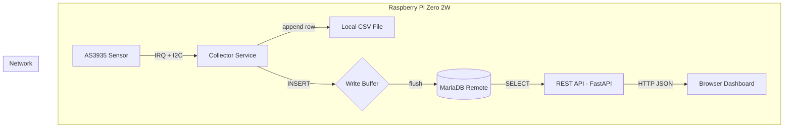
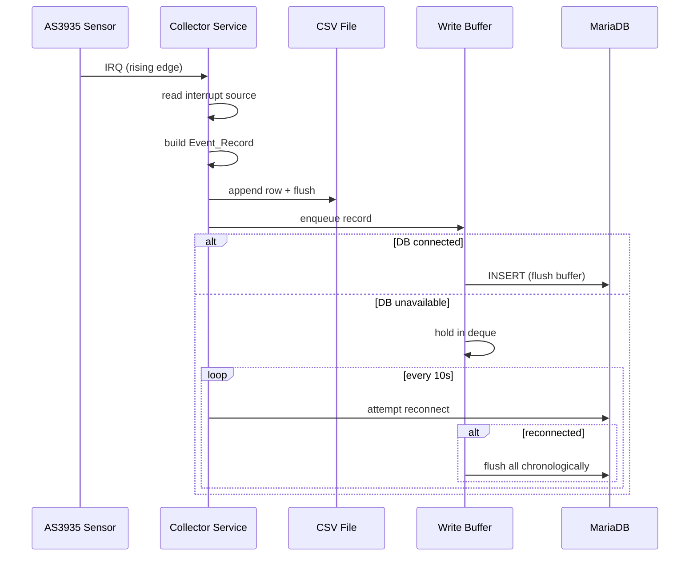

# Design Document: Lightning Data Pipeline

## Overview

The Lightning Data Pipeline extends the existing `dfrobot_as3935` sensor driver package with two new services:

1. **Collector Service** — A long-running daemon that listens for AS3935 interrupt events, constructs `Event_Record` objects, and persists them to both a local CSV file and a remote MariaDB database. It uses a bounded in-memory write buffer to handle transient network failures gracefully.

2. **REST API** — A FastAPI application served by uvicorn that queries MariaDB and exposes lightning event data over HTTP for browser-based dashboards.

Both services share a common configuration layer (pydantic-settings with TOML fallback) and data models, and are deployed as systemd units on a Raspberry Pi Zero 2W.

### Key Design Decisions

| Decision | Choice | Rationale |
|----------|--------|-----------|
| MariaDB connector | `mariadb` (official C connector) | Best performance for the Pi's limited resources; native connection pooling support; official MariaDB support |
| Web framework | FastAPI + uvicorn | Async-capable, auto-generated OpenAPI docs, lightweight |
| Write buffer | `collections.deque(maxlen=10000)` | O(1) append/popleft, automatic oldest-discard when full, thread-safe with GIL for single-producer |
| Configuration | `pydantic-settings` with `TomlConfigSettingsSource` | Type validation, env var priority over TOML file, built-in secret masking |
| Connection pooling (API) | `mariadb.ConnectionPool` | Built into the official connector, no extra dependency |
| Package layout | New sub-packages under `src/` | Keeps sensor driver independent; shared models importable by both services |

## Architecture





## Components and Interfaces

### Package Layout

```
src/
├── dfrobot_as3935/          # Existing sensor driver (unchanged)
│   ├── __init__.py
│   ├── constants.py
│   ├── sensor.py
│   └── validators.py
├── lightning_collector/     # New: Collector Service
│   ├── __init__.py
│   ├── __main__.py          # Entry point: python -m lightning_collector
│   ├── collector.py         # Main daemon loop + interrupt handler
│   ├── csv_writer.py        # CSV persistence component
│   ├── db_writer.py         # MariaDB persistence + write buffer
│   └── models.py            # Shared data models (re-exported)
├── lightning_api/           # New: REST API Service
│   ├── __init__.py
│   ├── __main__.py          # Entry point: python -m lightning_api
│   ├── app.py               # FastAPI application factory
│   ├── routes/
│   │   ├── __init__.py
│   │   ├── events.py        # /events, /events/latest, /events/stats
│   │   └── health.py        # /health
│   ├── dependencies.py      # DB pool dependency injection
│   └── models.py            # Pydantic response models (re-exported)
└── lightning_common/        # New: Shared code
    ├── __init__.py
    ├── config.py            # pydantic-settings configuration
    ├── db.py                # DB schema creation, connection helpers
    └── models.py            # EventRecord, EventType, shared schemas
```

### Component Interfaces

#### `lightning_common.models`

```python
from enum import StrEnum
from datetime import datetime
from pydantic import BaseModel

class EventType(StrEnum):
    LIGHTNING = "lightning"
    DISTURBER = "disturber"
    NOISE = "noise"

class EventRecord(BaseModel):
    timestamp: datetime          # UTC, ISO 8601
    event_type: EventType
    distance_km: int | None      # Only for lightning events
    energy_normalized: float | None  # Only for lightning events
```

#### `lightning_common.config`

```python
from pydantic_settings import BaseSettings, SettingsConfigDict
from pydantic_settings import TomlConfigSettingsSource

class CollectorSettings(BaseSettings):
    model_config = SettingsConfigDict(
        env_prefix="LIGHTNING_",
        toml_file="lightning.toml",
    )
    
    db_host: str
    db_port: int  # validated: 1-65535
    db_user: str
    db_password: str  # excluded from repr
    db_name: str
    csv_file_path: str = "/var/lib/lightning/events.csv"
    sensor_i2c_address: int = 0x03  # validated: 0x01, 0x02, 0x03
    sensor_i2c_bus: int = 1
    sensor_irq_pin: int = 4
    buffer_max_size: int = 10000

class ApiSettings(BaseSettings):
    model_config = SettingsConfigDict(
        env_prefix="LIGHTNING_",
        toml_file="lightning.toml",
    )
    
    db_host: str
    db_port: int
    db_user: str
    db_password: str
    db_name: str
    api_host: str = "0.0.0.0"
    api_port: int = 8000
    cors_origins: list[str] = ["*"]
    db_pool_size: int = 5
```

#### `lightning_collector.csv_writer`

```python
class CsvWriter:
    def __init__(self, file_path: str) -> None: ...
    def write(self, record: EventRecord) -> None: ...
    def close(self) -> None: ...
```

#### `lightning_collector.db_writer`

```python
from collections import deque

class DbWriter:
    def __init__(self, settings: CollectorSettings) -> None: ...
    
    @property
    def buffer_size(self) -> int: ...
    @property
    def is_connected(self) -> bool: ...
    
    def write(self, record: EventRecord) -> None: ...
    def flush_buffer(self) -> int: ...
    def reconnect(self) -> bool: ...
    def close(self) -> None: ...
```

#### `lightning_api.dependencies`

```python
from typing import Generator
import mariadb

def get_db_connection() -> Generator[mariadb.Connection, None, None]:
    """FastAPI dependency that yields a connection from the pool."""
    ...
```

#### `lightning_api.routes.events`

```python
# GET /events?page=1&page_size=50&start_date=...&end_date=...&event_type=...
# GET /events/latest
# GET /events/stats
```

## Data Models

### MariaDB Schema

```sql
CREATE TABLE IF NOT EXISTS events (
    id BIGINT UNSIGNED AUTO_INCREMENT PRIMARY KEY,
    timestamp DATETIME NOT NULL,
    event_type ENUM('lightning', 'disturber', 'noise') NOT NULL,
    distance_km INT DEFAULT NULL,
    energy_normalized FLOAT DEFAULT NULL,
    INDEX idx_timestamp (timestamp),
    INDEX idx_event_type (event_type)
) ENGINE=InnoDB DEFAULT CHARSET=utf8mb4;
```

### CSV Format

```
timestamp,event_type,distance_km,energy_normalized
2024-07-15T14:32:01.123456+00:00,lightning,12,0.45
2024-07-15T14:32:05.789012+00:00,disturber,,
2024-07-15T14:33:00.000000+00:00,noise,,
```

- `distance_km` and `energy_normalized` are empty strings for non-lightning events
- Timestamp is ISO 8601 with UTC timezone
- File is flushed after each write

### API Response Models

#### `GET /events` Response

```json
{
  "data": [
    {
      "id": 1,
      "timestamp": "2024-07-15T14:32:01.123456Z",
      "event_type": "lightning",
      "distance_km": 12,
      "energy_normalized": 0.45
    }
  ],
  "pagination": {
    "total_count": 150,
    "page": 1,
    "page_size": 50,
    "total_pages": 3
  }
}
```

#### `GET /events/latest` Response

```json
{
  "id": 150,
  "timestamp": "2024-07-15T14:32:01.123456Z",
  "event_type": "lightning",
  "distance_km": 12,
  "energy_normalized": 0.45
}
```

#### `GET /events/stats` Response

```json
{
  "count_by_type": {
    "lightning": 42,
    "disturber": 85,
    "noise": 23
  },
  "count_last_24h": 5,
  "count_last_7d": 28,
  "latest_event_timestamp": "2024-07-15T14:32:01.123456Z"
}
```

#### `GET /health` Response

```json
{
  "status": "healthy",
  "database": "connected",
  "uptime_seconds": 3600.5
}
```


## Correctness Properties

*A property is a characteristic or behavior that should hold true across all valid executions of a system — essentially, a formal statement about what the system should do. Properties serve as the bridge between human-readable specifications and machine-verifiable correctness guarantees.*

### Property 1: EventRecord construction correctness

*For any* interrupt source code (lightning=0x08, disturber=0x04, noise=0x01) and any valid sensor readings (distance 0–63, energy 0.0–1.0), the constructed EventRecord SHALL have `event_type` matching the interrupt source, `distance_km` and `energy_normalized` populated only when event_type is "lightning", and `timestamp` as a valid UTC datetime.

**Validates: Requirements 1.2**

### Property 2: CSV serialization round-trip

*For any* valid EventRecord, serializing it to a CSV row and parsing that row back SHALL produce an EventRecord with identical field values, and the CSV columns SHALL appear in the order: timestamp, event_type, distance_km, energy_normalized.

**Validates: Requirements 2.1, 2.2**

### Property 3: Write buffer preserves records in chronological order

*For any* sequence of EventRecords written while the database is unavailable, flushing the write buffer SHALL yield all records in the same chronological order they were enqueued.

**Validates: Requirements 3.3, 3.5**

### Property 4: Write buffer bounded size invariant

*For any* sequence of N EventRecords added to the write buffer (where N > 10000), the buffer size SHALL never exceed 10000, and the buffer SHALL contain only the most recent 10000 records.

**Validates: Requirements 3.6**

### Property 5: Configuration environment variable priority

*For any* configuration key that is set in both an environment variable and the TOML file with different values, the loaded configuration SHALL use the environment variable value.

**Validates: Requirements 4.1**

### Property 6: Configuration missing required field rejection

*For any* subset of required configuration fields where at least one required field is missing, attempting to load the configuration SHALL raise a ValidationError with a descriptive message naming the missing field.

**Validates: Requirements 4.3**

### Property 7: Configuration port validation

*For any* integer value assigned to DB_PORT or API_PORT, the configuration SHALL accept it if and only if it is in the range 1 to 65535 inclusive.

**Validates: Requirements 4.4**

### Property 8: Configuration I2C address validation

*For any* integer value assigned to SENSOR_I2C_ADDRESS, the configuration SHALL accept it if and only if it is one of 0x01, 0x02, or 0x03.

**Validates: Requirements 4.5**

### Property 9: API filter correctness

*For any* set of events in the database and any combination of filter parameters (start_date, end_date, event_type), all returned events SHALL satisfy every active filter condition, and no event satisfying all conditions SHALL be omitted from the total result set.

**Validates: Requirements 6.1, 6.2**

### Property 10: API results ordered by timestamp descending

*For any* query to the /events endpoint, the returned events SHALL have timestamps in strictly non-increasing order.

**Validates: Requirements 6.3**

### Property 11: API pagination metadata correctness

*For any* total_count ≥ 0 and page_size in 1–200, the pagination metadata SHALL satisfy: total_pages = ceil(total_count / page_size), and the number of items on the last page SHALL equal total_count - (total_pages - 1) * page_size.

**Validates: Requirements 6.4**

### Property 12: API page_size validation

*For any* integer page_size > 200, the /events endpoint SHALL return HTTP 422. *For any* integer page_size in 1–200, the endpoint SHALL accept the request.

**Validates: Requirements 6.5**

### Property 13: API latest returns most recent event

*For any* non-empty set of events in the database, the /events/latest endpoint SHALL return the event with the maximum timestamp value.

**Validates: Requirements 7.1**

### Property 14: API statistics correctness

*For any* set of events in the database, the /events/stats response SHALL satisfy: count_by_type values equal the actual count of events per type, count_last_24h equals the count of events with timestamp within the last 24 hours, count_last_7d equals the count within the last 7 days, and latest_event_timestamp equals the maximum timestamp.

**Validates: Requirements 8.1, 8.2**

### Property 15: Credential masking in log output

*For any* configuration containing a non-empty db_password string, the formatted log representation of the configuration SHALL NOT contain the literal password value.

**Validates: Requirements 12.2, 12.3**

## Error Handling

### Collector Service Error Handling

| Error Condition | Behavior | Recovery |
|----------------|----------|----------|
| Sensor I2C read fails | Log error, skip event | Continue listening for next interrupt |
| Sensor unresponsive on startup | Retry 3× with 333ms delay | Raise `ConnectionError`, systemd restarts |
| Sensor unresponsive during operation | Log error | Retry reconnection every 30s |
| CSV write fails (disk full, permissions) | Log error | Continue processing; next event retries write |
| MariaDB connection lost | Log warning, buffer records | Reconnect every 10s, flush buffer on success |
| MariaDB insert fails (connected) | Log error, buffer the record | Retry on next flush cycle |
| Write buffer full (10000 records) | Log warning, discard oldest | Continue buffering newest records |
| SIGTERM received | Flush CSV, attempt DB flush (5s timeout) | Exit cleanly |
| Configuration invalid | Raise `ValidationError` at startup | Service does not start; systemd logs error |

### REST API Error Handling

| Error Condition | HTTP Status | Response |
|----------------|-------------|----------|
| Invalid query parameter type | 422 | Pydantic validation error detail |
| page_size > 200 | 422 | `{"detail": "page_size must not exceed 200"}` |
| page < 1 | 422 | `{"detail": "page must be at least 1"}` |
| Invalid date format | 422 | Pydantic validation error detail |
| No events found for /events/latest | 404 | `{"detail": "No events found"}` |
| Database connection lost | 503 | `{"detail": "Database unavailable"}` |
| Unexpected server error | 500 | `{"detail": "Internal server error"}` |

### Graceful Degradation Strategy

The Collector Service is designed to never lose events to local storage:
1. CSV writes happen first (local, fast, reliable)
2. DB writes are best-effort with buffering
3. Buffer overflow discards oldest (newest data is most valuable)
4. On shutdown, CSV is flushed synchronously; DB flush has a 5s timeout

The REST API degrades gracefully:
1. Health endpoint reports "degraded" when DB is unavailable (HTTP 503)
2. Event endpoints return 503 when DB pool is exhausted
3. CORS and validation continue working regardless of DB state

## Testing Strategy

### Property-Based Testing (Hypothesis)

The project already uses Hypothesis (see `pyproject.toml` test dependencies). Property-based tests will be written for all 15 correctness properties identified above.

**Configuration:**
- Library: `hypothesis` (already in project dependencies)
- Minimum iterations: 100 per property (via `@settings(max_examples=100)`)
- Tag format: `# Feature: lightning-data-pipeline, Property {N}: {title}`

**Test organization:**
```
tests/
├── test_properties.py              # Existing sensor property tests
├── test_pipeline_properties.py     # New: Properties 1-4 (collector logic)
├── test_config_properties.py       # New: Properties 5-8 (configuration)
├── test_api_properties.py          # New: Properties 9-14 (API logic)
├── test_credential_properties.py   # New: Property 15 (credential masking)
```

### Unit Tests (Example-Based)

Unit tests cover specific scenarios, edge cases, and integration points:

- **CSV Writer**: File creation with header, empty file handling, write after failure recovery
- **DB Writer**: Successful insert, connection loss detection, buffer flush on reconnect
- **API endpoints**: Empty database responses (404, zero stats), health check states
- **Configuration**: All settings loaded correctly, TOML file parsing

### Integration Tests

Integration tests verify end-to-end behavior with real (or containerized) MariaDB:

- Schema creation idempotency
- Collector → MariaDB → API round-trip
- Graceful shutdown sequences (SIGTERM handling)
- Reconnection behavior after DB restart

### Test Markers

```ini
[tool.pytest.ini_options]
markers = [
    "property: Property-based tests (Hypothesis)",
    "unit: Example-based unit tests",
    "integration: Tests requiring MariaDB connection",
    "smoke: Configuration and structure checks",
]
```
